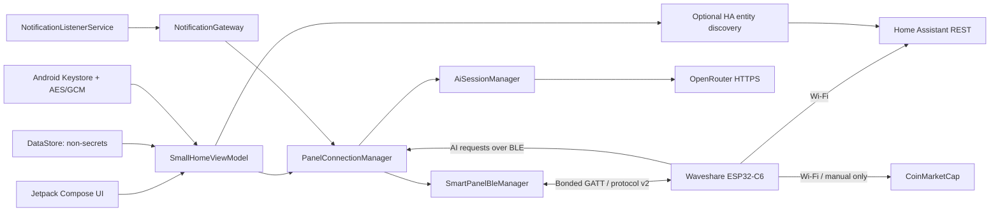
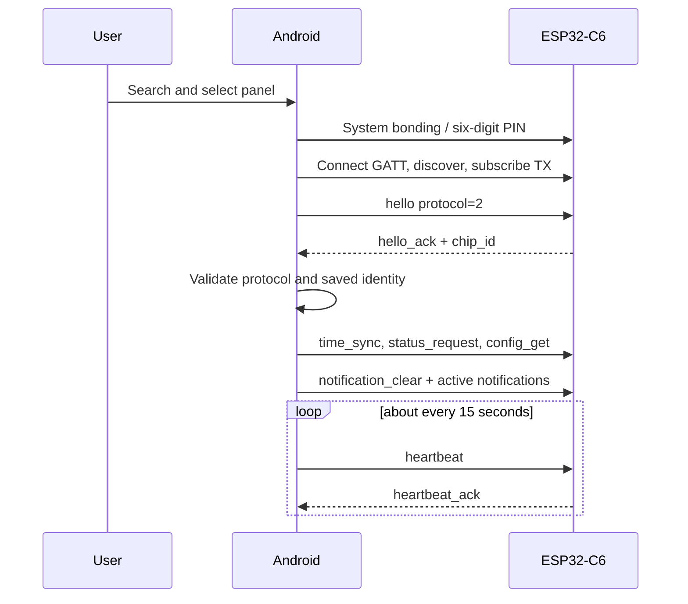

# Architecture

## System boundaries

## Android responsibilities

- request Bluetooth permissions and initiate system bonding;
- scan by the SmartPanel service UUID and present candidates;
- maintain GATT, TX notifications, an ordered RX write queue, heartbeat, and
  reconnect backoff;
- frame compact UTF-8 JSON with newline terminators and 18-byte chunks;
- validate protocol 2 and `chip_id` before accepting a panel;
- persist only non-secret device metadata in DataStore;
- encrypt retained HA, CMC, and OpenRouter credentials;
- capture selected notifications and route dismiss requests;
- keep OpenRouter session context only in memory;
- query Home Assistant for the full entity catalog and persist the user's explicit panel
  role assignment independently of the entity's native domain.

## ESP32-C6 responsibilities

- display and secure the BLE passkey, serve the authenticated GATT service, and
  persist panel configuration in NVS;
- use Wi-Fi directly for NTP, Home Assistant, and manual CoinMarketCap refresh;
- own light/thermostat roles, derive each selected entity's real HA service
  domain, and own lock/button behavior, brightness, and Flappy Bird;
- request notification dismissal and AI work from Android over BLE.

## Connection sequence

The phone and panel do not need to be on the same Wi-Fi. Cleartext local-network
access in Android exists only for optional Home Assistant entity discovery.
